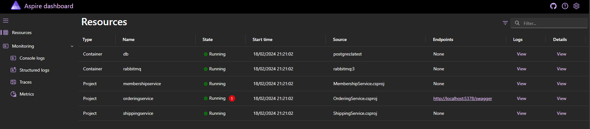

# Payment order processor technical task

A payment processing service for a fictituous company FunBooksAndVids.

The aim of the service is to provide some basic REST API's around payment processing for purchase orders and apply several business rules.

Contents:

- [Solution Structure](#solution-structure)
- [Tasks](#tasks)
- [Testing](#testing)
- [Rationale for event driven pattern](#rationale-for-event-driven-pattern)
- [Improvements with more time](#improvements-with-more-time)
- [Running the project](#running-the-project)
  - [docker-compose](#1-run-using-docker-compose)
  - [Aspire](#2-run-using-aspirehost)

## Solution Structure

The solution has a few services.

- [OrderingService](./src/Ordering/OrderingService/): Service that exposes a REST API over the PurchaseOrder domain models, and includes Purchase Order Processing workflows
- [ShippingService](./src/Shipping/ShippingService/): Worker that consumes OrderSubmissions and applies shipping business logic.
- [MembershipService](./src/Shipping/ShippingService/): Worker that consumes OrderSubmissions and applies membership business logic (note: only partially complete).
- [Aspire AppHost](./src/AppHost/): Uses .NET aspire to orchestrate the other projects (for ease of development)

Each service has a mini onion-architecture within a single project

- `Web`: Contains controllers and other http concerns
- `Application`: Contains application features & use-cases
- `Domain`: Contains domain models
- `Infrastructure`: Contains infra level concerns (e.g. Database queries & migrations)

## Tasks

### 1. Object-Oriented model of the system exposed as a REST API

- [Domain Models](./src/Ordering/OrderingService/Domain/)
- [Product Controller](./src/Ordering/OrderingService/Controllers/ProductsController.cs)
- [PurchaseOrder Controller](./src/Ordering/OrderingService/Controllers/PurchaseOrderController.cs)

### 2. Implement a flexible Purchase Order Processor

My purchase order processor is implemented as a regular REST endpoint. The pattern I decided to follow was to publish an event using a transactional outbox, so that other business rules could hook into the event process (reationale covered below)

- [SubmitPurchaseOrderHandler.cs](./src/Ordering/OrderingService/Application/PurchaseOrders/SubmitPurchaseOrder/SubmitPurchaseOrderHandler.cs)
- [OrderSubmitted.cs](./src/Ordering/OrderingService.Contracts/Events/OrderSubmitted.cs)

### 3. Implement the business rules

Membership:

- [MembershipEnrollmentConsumer.cs](./src/Membership/MembershipService/Application/MembershipEnrollment/MembershipEnrollmentConsumer.cs)

Shipping:

- [ProductShippingConsumer.cs](./src/Shipping/ShippingService/Application/ProductShipping/ProductShippingConsumer.cs)

## Testing

The sln demonstrates several different types of testing:

- [Standard unit testing with xunit, autofixture, etc](./src/Ordering/OrderingService.Tests/Application/PurchaseOrders/SubmitPurchaseOrder/SubmitPurchaseOrderHandlerTests.cs)
- [Integration tests against a db using TestContainers](./src/Ordering/OrderingService.Tests/Infrastructure/Repositories/ProductRepositoryTests.cs)
- [Testing an event consumer](./src/Shipping/ShippingService.Tests/Application/ProductShipping/ProductShippingConsumerTests.cs)

## Rationale for event driven pattern

My read of the task is that there could be _n_ business rules applied on purchase processing that may have side effects (e.g. Sending emails). My main concern with implementing a purchase order processor was to put in a pattern that preserves durability in the event that the rules aren't applied transactionally with saving a PurchaseOrder.

The solution I chose was to use a TransactionalOutbox (provided by a 3rd party lib) to insert an event into the db transactionally with the purchase order, and then after the event is consumed and placed on the service bus (rabbitmq), to hook into this to apply business logic from different service domains.

## Improvements with more time

- MembershipService was only partially implemented, could have added proper data models

- Intention was for each service to have its own projection of domain models (e.g. What shipping needs from a product model is different from what the ordering service needs). I did add these seperate projections, but didn't get round to showing how I'd sync these between the services.

- Authentication/Authorization: currently the endpoints are open, but in an ideal world we'd have something like OAuth to identity a customer, and then the customerID could be mapped from a JWT or similar.

- End-to-end tests to cover the entire system including controller endpoints

## Running the project

The services can be run individually, but in order to run the entire project I've added two approaches:

### 1. Run using docker-compose

Dependencies

- Docker

build services:

```sh
docker-compose --build
```

Start services:

```
docker-compose up -d
```

Once started, the following urls will be available

- Ordering Service: http://localhost:8080
- Postgres: localhost:5432 (user postgres, pass postgres)

### 2. Run using AspireHost

Dependencies

- .NET Aspire
- Preview version of .NET (>8.0.200-preview.23624.5)
- Docker
- VisualStudio

Run the AspireAppHost project from VisualStudio, this should open the Aspire Host which shows all the running services like this:


